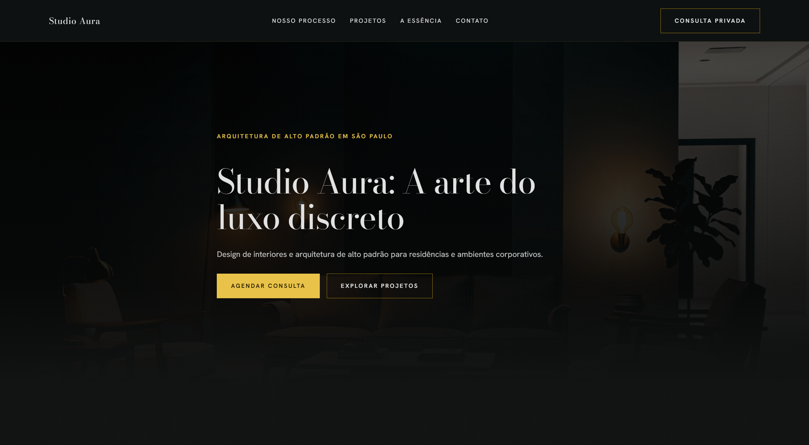
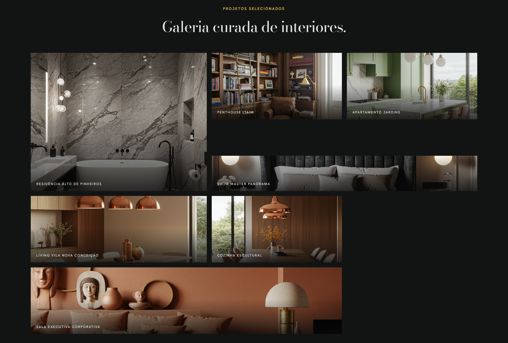

# Studio Aura — Landing page

Landing page imersiva para o **Studio Aura** (Marina Vasconcelos): arquitetura e interiores de alto padrão, com foco em **luxo discreto**, conversão de leads qualificados e narrativa visual de boutique.

Este repositório é um exemplo de **produto unindo especificação orientada a marca, engenharia front-end e uso assistido por IA**: o brief vive em `docs/prd.md`; a implementação é HTML, CSS e JavaScript nativos, com animações e scroll pensados para sensação premium.

---

## Preview

<p align="center">
  <a href="https://keuvyndev.github.io/lp-aura-design/">
    
  </a>
</p>

<p align="center">
  <a href="https://keuvyndev.github.io/lp-aura-design/">
    
  </a>
</p>

---

## Live demo

```txt
https://keuvyndev.github.io/lp-aura-design/
```

---

## Highlights

- Scroll-driven storytelling com **GSAP + ScrollTrigger**
- Hero cinematográfico com vídeo e layering
- Arquitetura em **HTML/CSS/JS nativos**
- Galeria dinâmica gerada via JavaScript
- Sistema visual inspirado em boutique hotels e galerias
- Fluxo orientado por **PRD + IA + refinamento manual**
- Layout responsivo premium com foco em percepção de marca

---

## Objetivo e conceito (brief)

Conforme o [PRD](docs/prd.md):

- **Conceito visual:** “The Curated Void” — riqueza material com respiro espacial; direção inspirada em _boutique hotels_ e galerias de arte.
- **Público:** leads de alto poder aquisitivo.
- **Jornada em uma página:** hero com vídeo, processo em três momentos, galeria assimétrica, essência da fundadora, depoimentos e contato (formulário + WhatsApp).

---

## Tecnologias

| Camada                          | Uso no projeto                                                                                                                                      |
| ------------------------------- | --------------------------------------------------------------------------------------------------------------------------------------------------- |
| **HTML5**                       | Estrutura semântica (`header`, `main`, `section`, `nav`, `article`), acessibilidade básica (`aria-`\*, `role="status"`), meta SEO e `lang="pt-BR"`. |
| **CSS3**                        | Variáveis (`:root`), Grid e Flexbox, `clamp()` para tipografia fluida, `backdrop-filter`, transições, media queries e overlay de ruído sutil.       |
| **Google Fonts**                | **Bodoni Moda** (títulos) e **Hanken Grotesk** (corpo e UI), alinhados ao design system do brief.                                                   |
| **JavaScript (ES6+)**           | Módulo único sem framework: dados do portfólio, formulário com validação, menu mobile, slider de depoimentos e `IntersectionObserver`.              |
| **GSAP 3.12.5 + ScrollTrigger** | Seção “processo” com pin do vídeo, scrub no scroll e timeline sincronizada ao `currentTime` do vídeo.                                               |

O projeto não exige build step obrigatório: é um site **estático**, adequado a hospedagem em CDNs ou servidores de arquivos estáticos.

---

## Architectural decisions

O projeto utiliza HTML, CSS e JavaScript nativos para:

- reduzir overhead de framework
- maximizar controle fino de animações
- eliminar complexidade de build
- otimizar carregamento inicial
- explorar diretamente capacidades modernas da plataforma web

A escolha por uma stack enxuta favorece a estética cinematográfica e a fluidez visual do projeto.

---

## Desenvolvimento e IA

A IA foi utilizada como ferramenta de aceleração criativa e técnica ao longo do processo:

- apoio na prototipação
- refinamento iterativo de copy
- estruturação inicial de markup e estilos
- exploração visual orientada pelo PRD

Toda implementação final, decisões de arquitetura, refinamentos visuais, responsividade, integração de animações e ajustes de UX passaram por curadoria e revisão manual.

O fluxo **PRD → implementação → refinamento manual** posiciona o projeto como um estudo de **engenharia assistida por IA**, combinando especificação, direção visual e desenvolvimento front-end.

---

## Performance considerations

- Lazy loading de imagens
- Uso de `IntersectionObserver` para reveals
- Estrutura sem dependências pesadas de UI
- Animações baseadas em `transform` e `opacity`
- Vídeos otimizados para experiência web
- CSS organizado com variáveis e responsividade fluida

---

## Developer experience

- Estrutura desacoplada
- Design system centralizado em CSS variables
- Dados do portfólio organizados em arrays JavaScript
- Fácil substituição de assets e conteúdos
- Sem necessidade de tooling complexo
- Projeto simples de portar para frameworks futuros

---

## Estrutura do repositório

```txt
Aura/
├── index.html
├── src/
│   ├── css/
│   │   └── styles.css
│   ├── js/
│   │   └── script.js
│   └── assets/
├── docs/
│   └── prd.md
```

---

## Assets esperados

- `src/assets/interior-dark-video.mp4` — vídeo do hero
- `src/assets/video-camadas.mp4` — narrativa visual do processo
- imagens do portfólio e seção Essência

---

## Como visualizar

1. Garanta que os caminhos de `css/`, `js/` e `assets/` estejam corretos no `index.html`.
2. Sirva a pasta com um servidor local:

```bash
# Node
npx --yes serve .

# Python
python -m http.server 8080
```

1. Abra a URL indicada no navegador.

---

## Funcionalidades implementadas

- Hero com vídeo em loop e overlay cinematográfico
- Scroll storytelling com vídeo sincronizado
- Galeria assimétrica dinâmica
- Reveal animations via viewport
- Slider automático de depoimentos
- Formulário validado client-side
- CTA direto para WhatsApp
- Header fixo com blur e menu responsivo

---

## Licença e créditos

Conteúdo de marca **Studio Aura** conforme brief interno. Ajuste direitos de imagem e vídeo antes de publicação pública.

---

© 2026 — Projeto de portfólio / estudo Aura: interiores premium, narrativa visual imersiva e fluxo moderno de especificação + IA + engenharia front-end.
